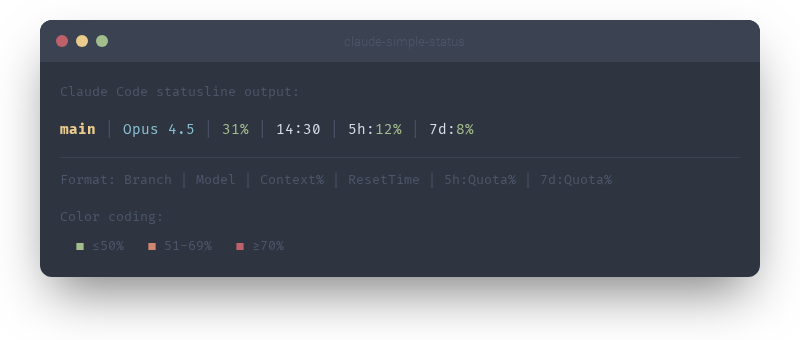

<p align="center">
  
</p>

# claude-simple-status

[](https://opensource.org/licenses/MIT)
[](https://nodejs.org/)
[]()

A simple, no-frills statusline for [Claude Code](https://docs.anthropic.com/en/docs/claude-code) that shows what matters: **git branch, model, context usage, and quota**.



## Features

- **Zero dependencies** — single Node.js script, no npm packages
- **Cross-platform** — works on macOS, Linux, and Windows
- **Non-blocking** — returns cached data instantly, refreshes quota in the background
- **Color-coded** — green/orange/red percentages at a glance
- **Git-aware** — shows the current branch name in repos
- **Timezone-smart** — quota reset time converted to your local timezone

If the quota API is unreachable, a red `ERR` indicator appears at the end and clears automatically once the connection recovers.

## Installation

**macOS / Linux:**
```bash
curl -fsSL https://raw.githubusercontent.com/edimuj/claude-simple-status/main/install.sh | bash
```

**Windows (PowerShell):**
```powershell
irm https://raw.githubusercontent.com/edimuj/claude-simple-status/main/install.ps1 | iex
```

The statusline appears immediately at the bottom of Claude Code.

<details>
<summary>Manual installation (macOS / Linux)</summary>

**1. Copy the script**

```bash
mkdir -p ~/.claude/statusline
curl -o ~/.claude/statusline/statusline.mjs \
  https://raw.githubusercontent.com/edimuj/claude-simple-status/main/statusline.mjs
```

**2. Configure Claude Code**

Add to your `~/.claude/settings.json`:

```json
{
  "statusLine": {
    "type": "command",
    "command": "node ~/.claude/statusline/statusline.mjs"
  }
}
```

</details>

<details>
<summary>Manual installation (Windows)</summary>

**1. Copy the script**

```powershell
New-Item -ItemType Directory -Path "$env:USERPROFILE\.claude\statusline" -Force
Invoke-WebRequest -Uri "https://raw.githubusercontent.com/edimuj/claude-simple-status/main/statusline.mjs" -OutFile "$env:USERPROFILE\.claude\statusline\statusline.mjs"
```

**2. Configure Claude Code**

Add to your `%USERPROFILE%\.claude\settings.json`:

```json
{
  "statusLine": {
    "type": "command",
    "command": "node ~/.claude/statusline/statusline.mjs"
  }
}
```

</details>

## Uninstall

Remove the script and the `statusLine` entry from your settings:

```bash
# macOS/Linux
rm -rf ~/.claude/statusline
```

```powershell
# Windows (PowerShell)
Remove-Item -Recurse "$env:USERPROFILE\.claude\statusline"
```

Then delete the `"statusLine"` block from `~/.claude/settings.json`.

## Requirements

- Claude Code CLI
- Node.js (v18+)

## How it works

1. Receives model/context info from Claude Code via stdin (JSON)
2. Reads cached quota data and returns immediately (never blocks the UI)
3. If the cache is stale (>2 minutes), refreshes from Anthropic's OAuth API in the background
4. Converts UTC reset time to your local timezone
5. Outputs a formatted statusline with ANSI colors

Quota data is cached to the system temp directory and refreshed every 2 minutes. Since Claude Code calls the statusline on every message update, this avoids excessive API calls while keeping the data fresh.

## Troubleshooting

If the statusline shows `ERR`, check the error log:

```bash
# macOS/Linux
cat /tmp/claude-statusline.log

# Windows (PowerShell)
Get-Content $env:TEMP\claude-statusline.log
```

To force a fresh quota fetch, clear the cache:

```bash
# macOS/Linux
rm /tmp/claude-statusline-quota.json

# Windows (PowerShell)
Remove-Item $env:TEMP\claude-statusline-quota.json
```

## Contributing

Contributions are welcome! This project follows a few principles:

- Single file, zero dependencies
- Cross-platform (macOS, Linux, Windows)
- Never block the UI

Open an [issue](https://github.com/edimuj/claude-simple-status/issues) or submit a pull request.

## License

[MIT](https://opensource.org/licenses/MIT)
